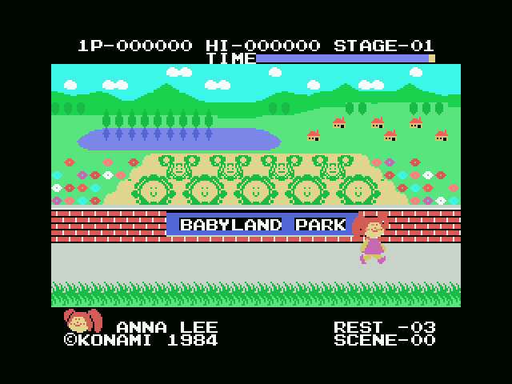

# El juego

Tu muñeco anda por **BABYLAND PARK**, donde los bebés crecen en repollos. El
cartel del parque está escrito en el propio cartucho: diecisiete tiles en
`0x6BE5`.

## Dos preguntas antes de jugar

El menú no lleva directo al juego. Con el disparo sobre `PLAY SELECT` se elige
una de las cuatro opciones —uno o dos jugadores, joystick o teclado— y entonces
salen dos pantallas de preparación, las dos con las mismas cuatro teclas:
arriba y abajo cambian lo que hay bajo el cursor, la derecha mueve el cursor y
el espacio termina.

**Primero eliges el muñeco.** Dos bytes, `0xE05B` y `0xE05C`, llevan la fila y
la columna de cada mitad de la figura; `0x78C9` los lee y coloca cinco sprites
con ellos.

**Y luego le pones nombre.** Diez letras en `0xE05D`, que `0x7968` recorre en
redondo entre el blanco y la Z. De fábrica el nombre es **ANNA LEE**, y está en
los valores de arranque del jugador, en `0x44A3`, justo al lado de las vidas y
el reloj. Con dos jugadores la pantalla se repite, una vez por cada uno
(`0x426B`).

El nombre no es un adorno: `0x79F5` pinta esas diez letras abajo en la pantalla
de juego, y ahí se quedan toda la partida.

## La pantalla

| | |
|---|---|
| arriba a la izquierda | los puntos de quien juega, `1P-` o `2P-` |
| arriba en el centro | `HI-`, el récord |
| arriba a la derecha | `STAGE-nn` |
| debajo | la barra de `TIME` |
| abajo a la izquierda | la cara del muñeco y su nombre |
| abajo a la derecha | `REST-nn`, las vidas, y `SCENE-nn` |

`STAGE` y `SCENE` son dos números distintos: la fase es la ronda y el SCENE es
la pantalla por la que vas dentro de ella.

## Lo que el cartucho lleva contado

- **Las vidas** en `0xE050`, tres al empezar (`0x44A3`).
- **Los puntos** en BCD, tres bytes por jugador (`0xE043` y `0xE046`), y el
  récord en `0xE040`. `SUMA_PUNTOS` (0x4651) topa en 999999.
- **Una vida extra** en el umbral de `0xE052`, que sube 20.000 cada vez
  (`0x4688`); cuando ya no quedan por dar se queda en 0xFF.
- **El reloj** en `0xE055`, que `TIEMPO` (0x5F13) va gastando y pintando en la
  barra. Por debajo de 0x10 avisa con un pitido cada 64 fotogramas.

## Dos jugadores

El bloque entero del segundo jugador vive en `0xE080`, y
`ESTADO_13_CAMBIO_TURNO` intercambia los dos al cambiar de turno, así que el
resto del código trabaja siempre sobre el mismo sitio sin enterarse de a quién
le toca. El rótulo de arriba a la izquierda, `1P-` o `2P-`, parpadea cada 32
fotogramas para el que está jugando (`0x4735`).
