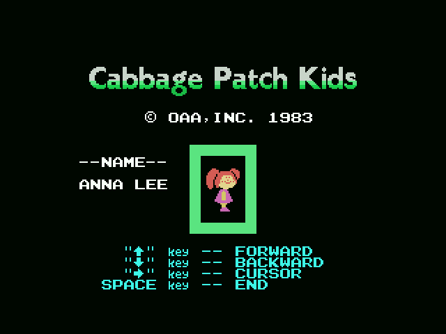

# Hallazgos

## Viajan datos de otro juego, y aquí no los lee nadie

Tres bloques son, **byte a byte**, datos de **Athletic Land**, el cartucho
anterior de la casa:

| aquí | bytes | allí | desfase |
|---|---|---|---|
| 0x6718 | 16 | 0x6DD4 | +1.724 |
| 0x6AA6 | 251 | 0x6E90 | +1.002 |
| 0x6BF6 | 172 | 0x6FF9 | +1.027 |

Son las listas de fondo y los tiles de los cerros y las mesetas. Y **no se
usan**: ninguna instrucción del cartucho los apunta con un inmediato, y sus
direcciones tampoco aparecen dentro de ninguna tabla. Lo mismo pasa con la
rutina muerta de `0x44D2`, cinco bytes que pondrían el color del borde y a los
que no llama nadie — la misma rutina, en el mismo estado, que aquel cartucho
lleva.

Y eso no es una suposición de familia. Este juego **es** aquel motor
recompilado: alineando los dos instrucción a instrucción, con los operandos de
16 bits a cero, **el 68,5 % de las instrucciones casan una a una**, en
veintinueve tramos de veinte instrucciones o más. Lo que sobra son 439 bytes de
decorado que ya no pinta nadie.

### Y por eso las anotaciones llevan guardiana

Como el motor es el mismo, las anotaciones se trajeron con
`tools/porta_desde_athletic.py`, que alinea los dos listados y mueve cada
etiqueta y cada comentario a la dirección que le toca aquí. Eso pone el
comentario en el sitio correcto, pero **no cambia lo que dice**, y el
reensamblado no puede notarlo: un comentario no es un byte.

`tools/repasa_el_porte.py` es la comprobación, y no es heurística. Cazó, entre
otras cosas, cinco comentarios que publicaban las cuentas de tiles del hermano
—un `ld hl,nn` normalizado es la misma instrucción en los dos cartuchos, y la
cifra de la que habla está en el `ld bc,nn` de debajo—. Por eso compara la
instrucción del comentario **y la siguiente**.

## Le pones nombre a tu muñeco, y el nombre juega

Entre el menú y el juego hay dos pantallas. En la primera se elige el muñeco;
en la segunda se escribe su nombre, diez letras, que de fábrica dice **ANNA
LEE** — y eso está escrito en los valores de arranque del jugador, en `0x44A3`,
al lado de las tres vidas y el reloj, así que el nombre es tan parte de empezar
una partida como ellos.

Con dos jugadores la pantalla vuelve: `0x426B` ve el disparo y, si el bit 5 de
`0xE002` dice que son dos, cambia de turno y devuelve el paso del menú a 1 para
que el otro bautice el suyo.

## 138 bytes de código con pinta de datos

El despachador no vuelve nunca a su `call`, así que lo que tenga que correr
después de un estado se empuja antes en la pila. Sin caer en eso, dos rutinas
enteras —el parpadeo del rótulo del jugador y la lectura de teclas del menú— no
las alcanza el trazador y salen del listado como si fueran un pegote de datos.

La evidencia es una sola instrucción: `ld hl,04735h` y `ld hl,040c1h` en 0x4131
y 0x4136, y el `push hl` de 0x4140.

## Los 256 bytes que se pidieron como 24

La copia espejada cuenta con B. La llamada de `0x6CD1` carga `ld bc,0x0018`,
que pone 0x18 en **C** y deja **B a cero**, y un `djnz` desde cero da 256
vueltas. Así que esa copia lleva 256 bytes a la tabla de patrones, de los que
luego las dos copias siguientes pisan el medio: lo que queda a la vista de ella
son los dos extremos.

## No lleva la marca oculta

Muchos cartuchos de Konami esconden detrás del relleno del final de la ROM su
número de catálogo y el título en katakana. El formato —el título al revés, su
longitud, las dos últimas cifras del RC en BCD y un `0xAA`— lo descubrió
**Manuel Pazos**
([@ManuelPazosMSX](https://threadreaderapp.com/thread/1437082207634575365.html)),
y es gracias a él que se sabe que hay que mirar ahí.

Éste no la lleva: `tools/marca_konami.py` no encuentra ningún `0xAA` que cierre
nada, y lo que hay al final son datos del reproductor de sonido. **El RC-716
sale del catálogo, no del binario.**

## Y el título dice de quién es la licencia

La pantalla del título pone `© OAA,INC. 1983` —Original Appalachian Artworks,
los dueños de los Cabbage Patch Kids— mientras que la de juego pone
`©KONAMI 1984`. Dos años distintos y dos dueños distintos, en dos pantallas
distintas, escritos con la misma fuente.
